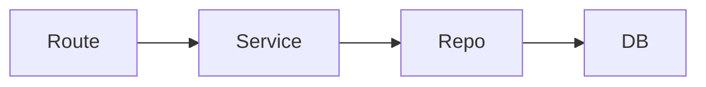

# Teach

Teach for understanding, not just orientation.

The goal is to help the user genuinely learn:
- what the relevant code or concept is for
- how the pieces fit together
- how control, data, and responsibilities move
- what assumptions or invariants matter
- what design tradeoffs or confusing parts are worth noticing

This skill is primarily explanatory. Stay focused on helping the user build a mental model. Point out important design issues or confusing structure when that would materially improve understanding, but do not drift into generic review mode.

## Scope

This skill usually applies to the current codebase, but it may also cover:
- a library or framework used by that code
- a protocol, runtime mechanism, or pattern needed to understand the implementation
- a small amount of surrounding product or systems context if it clarifies the code

Prefer the smallest scope that lets the user understand the thing they asked about.

## First-Class Inputs

Handle these as normal teaching targets:
- a module or package
- a feature or user flow
- a subsystem or architecture area
- an API boundary or integration
- a runtime path such as request handling, background jobs, or event flow
- a data model or state flow
- a library or framework behavior that is directly relevant to the code

If the user is actually asking about a diff, commit, PR patch, or file-to-file comparison, use `change-explainer` instead.

## Core Behavior

1. Start from the learner's question.
- Identify what the user is trying to understand, not just which files are nearby.
- Match the explanation depth to the request.
- If the user asks a broad question, narrow it to the smallest coherent mental model first.

2. Build a mental model before details.
- Begin with purpose, role, and boundaries.
- Then explain the main flow.
- Then drill into important mechanisms, edge cases, and invariants.
- Avoid starting with line-by-line code reading unless the user explicitly wants that.

3. Use snippets as the primary teaching aid.
- Embed short, focused snippets directly in the response.
- Prefer the smallest snippet that makes the idea legible.
- Use multiple small snippets to explain separate ideas.
- Do not force the user back into the editor just to follow the explanation.

4. Use diagrams when structure is easier to see than describe.
- Add a small diagram when it materially improves understanding of:
  - control flow
  - data flow
  - component or module relationships
  - state transitions
  - layered architecture or request lifecycles
- Keep diagrams compact and readable.
- Do not add a diagram if prose and snippets already make the point clear.

5. Teach relationships, not isolated facts.
- Explain who calls what, who owns what, and where decisions happen.
- Show how data changes shape as it crosses boundaries.
- Name the abstractions and responsibilities that matter to the flow.

6. Surface important confusion points.
- Call out misleading names, blurred responsibilities, hidden invariants, or awkward control flow when they materially affect understanding.
- Treat these as teaching notes, not as a full review.
- If the structure is mostly sound, say so plainly.

7. Use external context only when it helps.
- If library or framework behavior is necessary to explain the code, include only the part that changes how the code should be read.
- Keep external explanation tied to the code in front of you.

## Workflow

1. Identify the teaching target.
- Confirm whether the user wants to understand a module, flow, subsystem, data path, architecture area, or relevant external concept.
- Infer the likely target from the request and nearby context when needed.

2. Read top-down.
- Start from entry points, exported symbols, route handlers, public interfaces, or the main flow the user is asking about.
- Then read supporting helpers, data structures, and tests only as needed.
- Pull in docs such as `AGENTS.md`, `ARCHITECTURE.md`, or nearby notes when they materially change the explanation.

3. Organize the lesson.
- Prefer an order like:
  - what this part exists to do
  - where it sits in the system
  - the main runtime or data flow
  - the key mechanisms or abstractions
  - invariants, edge cases, and tradeoffs
- Reorder the material so the explanation is easy to learn, not so it mirrors file order.

4. Teach with evidence.
- For each important point, include a small snippet, pseudocode summary, concrete example, or compact diagram when appropriate.
- Explain why the snippet matters.
- Connect the evidence back to the larger mental model.

5. Close the loop.
- Summarize the model the user should now have.
- Mention the most important thing to remember about the design.
- If there is a major confusing or fragile area, call it out directly.

## Snippet Rules

- Use fenced code blocks for snippets.
- Keep snippets narrowly scoped to the mechanism being taught.
- Prefer signatures, conditions, branching points, state transitions, and interface boundaries over long contiguous code.
- When a relationship matters more than the exact syntax, summarize the flow around the snippet in prose.
- If helpful, pair snippets with a brief explanation like:

```ts
export async function loadUserDashboard(userId: string) {
  const account = await accountRepo.getByUserId(userId);
  return buildDashboardView(account);
}
```

This shows the boundary clearly: the function does orchestration, not heavy business logic. The repository fetches data, and the view builder shapes it for the caller.

## Diagram Rules

- Use diagrams only when they make the lesson easier to understand.
- Prefer plain Mermaid or compact ASCII diagrams that render clearly in Markdown.
- Keep them small and purpose-built for one idea.
- Favor these diagram types:
  - request or event flow
  - module relationship map
  - state transition sketch
  - data transformation pipeline
- Put the diagram near the explanation it supports.
- Explain the diagram briefly instead of assuming it is self-explanatory.

Example:



This works when the main teaching problem is ownership or call flow rather than syntax.

## Output Shape

Use this shape unless the user asks for something else:

### Big Picture
- One short paragraph on what this part of the system is for and where it fits.

### How It Works
- Explain the main flow in logical learning order.
- Use embedded snippets as evidence.
- Add a compact diagram if it makes the flow or relationships clearer.
- Focus on roles, boundaries, and movement of control or data.

### Key Ideas
- Call out the few abstractions, invariants, or decisions that make the design make sense.

### Important Confusion Points
- Include only when something materially affects understanding.
- Mention important design issues, awkward boundaries, or misleading structure briefly and concretely.

## Communication Rules

- Optimize for learning, not exhaustiveness.
- Prefer a coherent lesson over a file-by-file tour.
- Do not default to path or line references; use snippets first.
- Do not dump every related file into the answer.
- Label inferences as inferences when the code does not prove intent directly.
- If the user seems to want a concise overview, stay high-level.
- If the user clearly wants deeper teaching, go further into mechanisms and tradeoffs.

## Non-Goals

Do not use this skill as the default choice for:
- diff, commit, or patch explanation
- formal code review
- task-status catch-up for the current session
- broad external-library research disconnected from the current code

Use `change-explainer` for change-focused teaching, `briefing` for task-state recovery, and review-oriented skills when the user is asking for critique rather than understanding.

## Example Triggers

- "Teach me how this feature works."
- "Explain this subsystem so I can actually understand the design."
- "I want to learn the request flow from the route down to the database. Show snippets."
- "Teach me this flow with a diagram if that would make it easier to follow."
- "Teach me this module in a logical order, not file order."
- "Help me understand how this library is being used here and why the code is structured this way."
